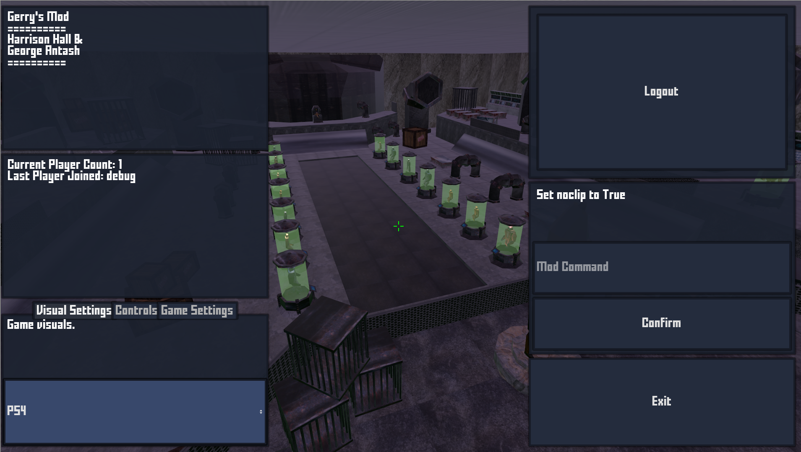

# Gerry's Mod
Gerry's Mod is an online multiplayer fps created in the Godot engine.
It its current (and final) form it supports a hub, multiple maps and game modes,
shooting, surfing, player models, enemies, and health tracking. The web server
was built in Flask with sockets for communication and is easily hostable on 
heroku. 

### About
Name comes from a play on Garry's Mod with Gerry being a portmanteau of
George and Harry.

Mechanics/Web/Interactions programmed by Harrison Hall
Art by George Antash
Shading and Maze generation by Biraj Dahal
Developed in November-December 2020

